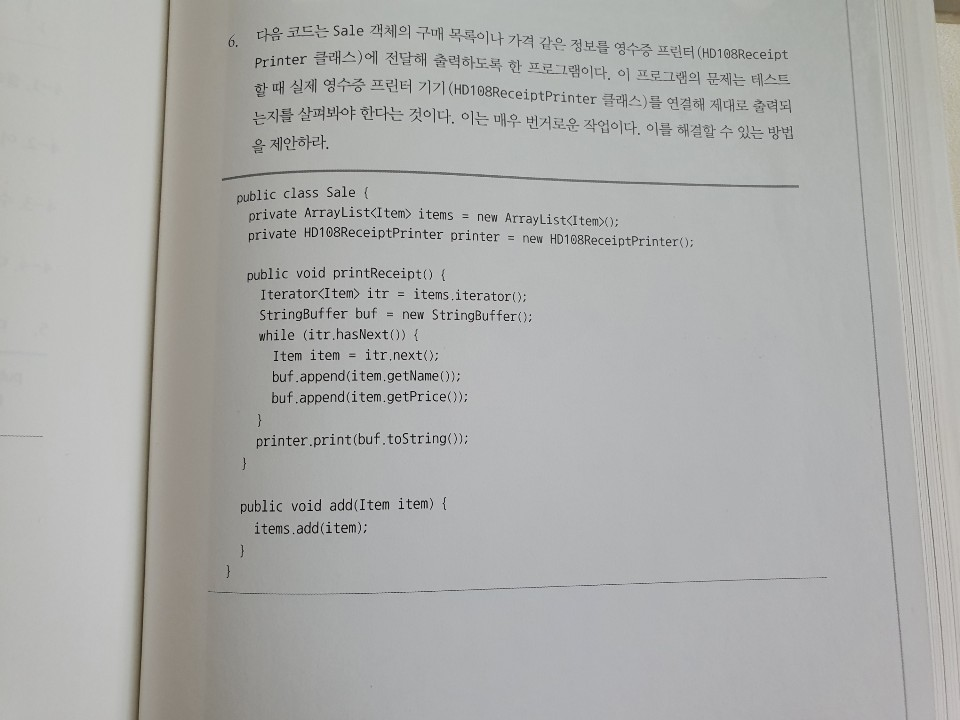

# toby_spring

Spring framework study with a book by Toby

## 참고자료
1. [Markdown 마크업 언어 간단한 사용법](https://github.com/sejong-interface/Interface_Manual/wiki/Git-%EC%8B%9C%EC%9E%91%ED%95%98%EA%B8%B0%233-README.md-%ED%8C%8C%EC%9D%BC-%EC%9E%91%EC%84%B1%ED%95%98%EA%B8%B0!)

--------------------------

### 1주차 과제
 * 1장 오브젝트와 의존관계(1) (53p ~ 101p)
#### 모임 일자 : 5월 29일(수요일)

### 2주차 과제
 * 1장 오브젝트와 의존관계(2) (102p ~ 143p)
#### 모임 일자 : 6월 4일(화요일)

### 3주차 과제
 * 2장 테스트 (145p ~ 208p)
#### 모임 일자 : 6월 12일(수요일)

### 4주차 과제
 * 3장 템플릿 (209p ~ 278p)
#### 모임 일자 : 6월 25일(수요일)

### 5주차 과제
 * 4장 예외 (279p ~ 316p)
 * 전략 패턴 문제(by lee)를 전략 패턴과 템플릿/콜백 적용해보기
 
 * SqlSessionTemplate, RestTemplate 살펴보기
#### 모임 일자 : 7월 3일(수요일)

### 6주차 과제
 * 5장 서비스 추상화 (317p ~ 375p)
#### 모임 일자 : 7월 10일(수요일)

### 7주차 과제
 * 5장 서비스 추상화 (375p ~ 399p)
 * 토비의 스프링 현재까지 소스 살펴보기
#### 모임 일자 : 7월 17일(수요일)

### 8주차 과제
 * 6장 AOP (401p ~ 429p)
 * 토비의 스프링 현재까지 소스 살펴보기
#### 모임 일자 : 7월 24일(수요일)

### 9주차 과제
 * 6장 AOP (429p ~ 475p)
 * 프록시/데코레이터 패턴 이해하기
#### 모임 일자 : 7월 31일(수요일)

### 10주차 과제
 * 6장 AOP (475p ~ 512p)
 * 데코레이터 패턴 문제 찾아보기
#### 모임 일자 : 8월 7일(수요일)
